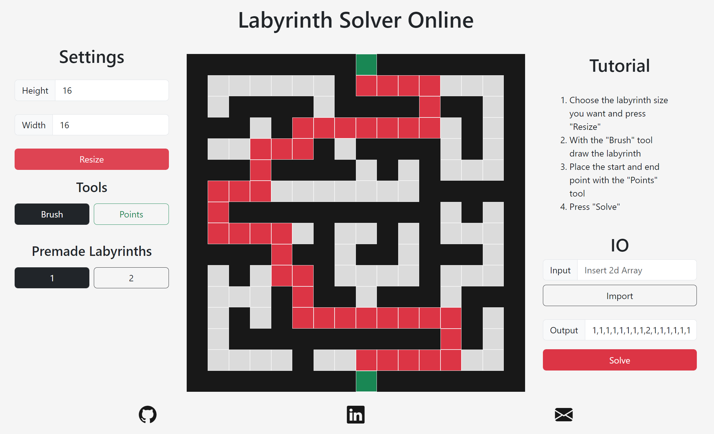

<h1 align="center">Labyrinth_Solver_Online</h1>

  <a href="https://henrique11varela.github.io/Labyrinth_Solver_Online/">
    Labyrinth Solver Online  
    
  </a>

This is a web port of a late night [project I made in C++](https://github.com/henrique11varela/Labyrinth_Solver) so that people can play around with the algorithm without downloading "dubious executables".

You can resize the board, draw your own labyrinth, import and export labyrinths or try one of the premade labyrinths.  
Just press solve and the shortest path between the 2 green points will be highlighed in red.